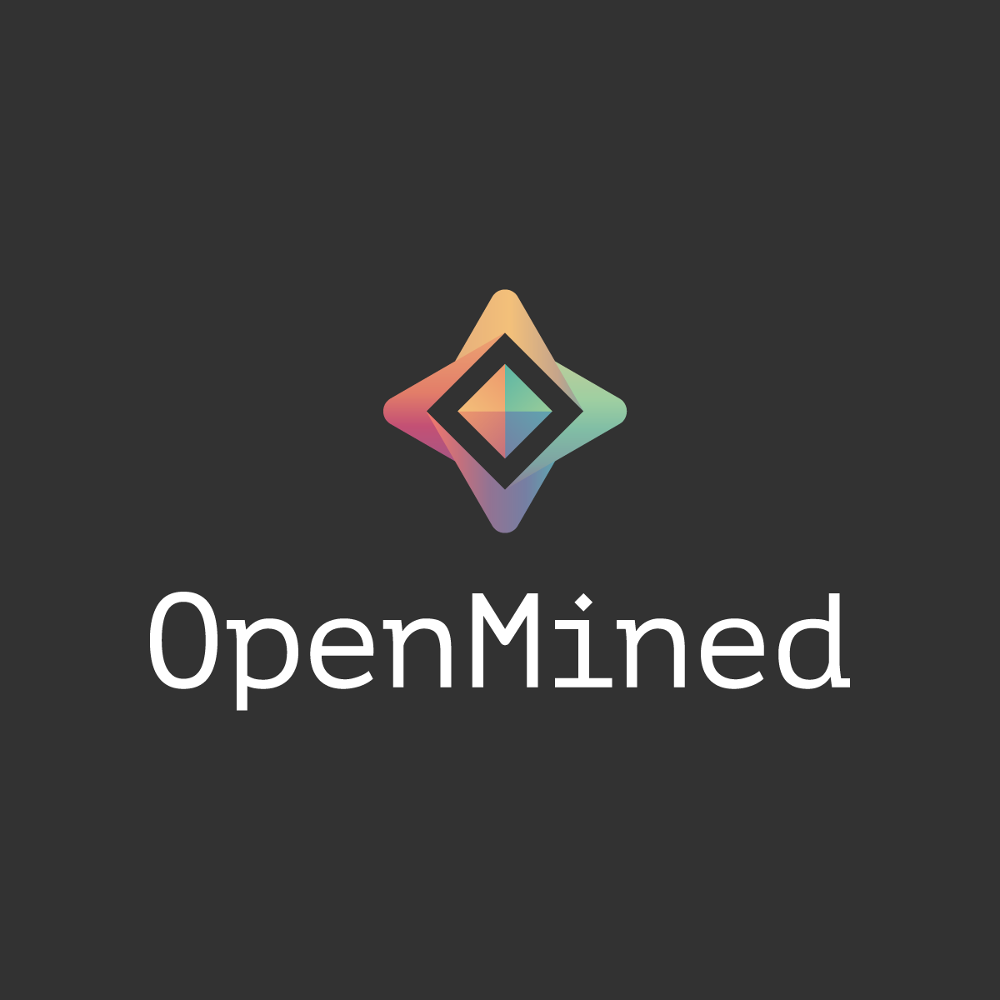

Welcome do Lucas's Blog. 
Learning PySyft things right now.

## Current Pursuit (Still learning context on this)
See [OpenMined](https://www.openmined.org/). It's far reaching and good for the world at large. Better descriptions come from the awesome people who wrote the tutorials. I'm currently working through those. 

This site uses: [Markdown](https://guides.github.com/features/mastering-markdown/). I'm keeping that nifty link on my homepage because I bookmark too many things.
